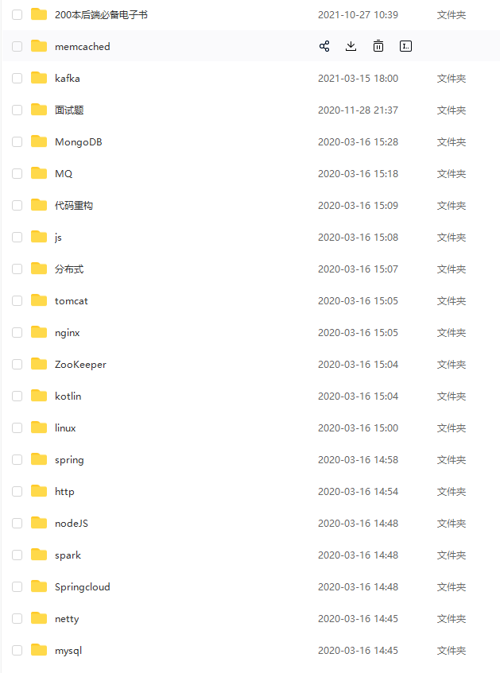

    
Springboot-Notebook

   
   
   
   

> 本项目全部案例详细教程，同步在 个人公众号：**程序员小富** , 欢迎关注交流指正，加群学习

[**作者小富，目前就职京东，点击一起来了解下**](https://mp.weixin.qq.com/s?__biz=MzAxNTM4NzAyNg==&mid=2247500646&idx=1&sn=5a0993997dc1fc609da4eda5ba610681&chksm=9b86539bacf1da8d2bc22b569d27e1b7b85a21a0ec7d5a5f4a6660148a5f40f076e2d42e4885&token=1045698719&lang=zh_CN#rd)

---

### 介绍

**Springboot-Notebook** 一个以 `springboot` 为基础开发框架，
整合 `Redis` 、`Mysql` 、 `Rabbitmq` 、`ES` 、`MongoDB`、`sharding-jdbc
分库分表`、`zookeeper` 、`web人脸识别` 、`实时消息推送` 、`SQL优化`、`注册中心` 、`数据脱敏` 等互联网主流技术，
文章图解理论配合实战案例，实现开发中常见功能点的综合项目。
本着拿来即用的原则，助力于减少开发者在工作中的学习成本。

中间件 | 已整合的功能
-------- | -----
分库分表 | sharding-jdbc
缓存  | Redis
数据库  | Mysql
消息队列  | Rabbitmq 、kafka
搜索引擎  | ES
非关系数据库  | MongoDB
注册中心  | zookeeper、nacos
虹软SDK  | web人脸识别
消息推送  | 7种实时消息推送
更多 | ......

### 面试八股

- 《spring cloud alibaba 微服务全家桶》

- 《面试笔记》

- 《LeetCode算法笔记》

**获取方式**：[公众号：**程序员小富** , 回复 **1222**](https://mp.weixin.qq.com/s?__biz=MzAxNTM4NzAyNg==&mid=2247500646&idx=1&sn=5a0993997dc1fc609da4eda5ba610681&chksm=9b86539bacf1da8d2bc22b569d27e1b7b85a21a0ec7d5a5f4a6660148a5f40f076e2d42e4885&token=1045698719&lang=zh_CN#rd)

### 电子书

[**2000本电子书 下载**](https://github.com/chengxy-nds/Firebook-Library)

### 优质文章精选

#### Java 开发技巧

- [3种 Springboot 全局时间格式化方式，别再写重复代码了](https://mp.weixin.qq.com/s/MeDfnL__jdEq7Yi48vg_vA) (`springboot-global-formatting`)
- [真是没想到，Springboot + Flowable 开发工作流会这么简单！](https://mp.weixin.qq.com/s/hXS9HirRnhYRMIwd4GVeIQ) (`springboot-work-flowable`)
- [3 分钟生成一个单元测试报告，这个样式爱了](https://mp.weixin.qq.com/s/5IW76pMMxRtVF-ewmp1PGw) (`springboot-testng-report`)
- [实用！一键生成数据库文档，堪称数据库界的Swagger](https://mp.weixin.qq.com/s/nqxWD85XdhR1AHAa2ql65A) (`springboot-database-doc`)
- [又被逼着优化代码，这次我干掉了出入参 Log日志](https://mp.weixin.qq.com/s/hZ7KiFyeDMRCPUoNlCXO6w) (`springboot-aop-unifiedlog`)
- [OAuth2.0 的四种授权方式](https://mp.weixin.qq.com/s/in_E1pKqQc8wkPXT61g8gQ)
- [Github 做授权登录就是这么简单！（OAuth2.0实战`)](https://mp.weixin.qq.com/s/KzWE4EtZ6F4_-2fYnVA5QA)
- [PC人脸识别登录，出乎意料的简单](https://mp.weixin.qq.com/s/YMgMRhd4E9ovGf_Kp19pPQ)
- [被迫重构代码，这次我干掉了 if-else](https://mp.weixin.qq.com/s/-nmGpxa4nao8jPwuPgf0LQ)
- [过滤器 和 拦截器 6个区别，别再傻傻分不清了](https://mp.weixin.qq.com/s/KwlqFezzTkOfg97M59n3GA)
- [6种 @Transactional 注解失效场景](https://mp.weixin.qq.com/s/wUQwzPGo3NNodr2pHzB_lw)
- [为了不复制粘贴，我被逼着学会了JAVA爬虫](https://mp.weixin.qq.com/s/rF9W00BUCCYHo7M6W5TBoA)
- [奇淫巧技，CompletableFuture 异步多线程是真的优雅](https://mp.weixin.qq.com/s/hFULNO8ehi-zBsz-K_jn5g)
- [6000 字 | 16 图，吃透 Spring Cloud Gateway 原理](https://mp.weixin.qq.com/s/e_B9HUhOfqWiKWN-k2Yrjg)
- [奇淫巧技，CompletableFuture 异步多线程是真的优雅](https://mp.weixin.qq.com/s/hFULNO8ehi-zBsz-K_jn5g)
- [我有 7种 实现web实时消息推送的方案，7种！](https://mp.weixin.qq.com/s/xQV81HiD8hkzx2wMc3ZT7A) (`springboot-realtime-data`)
- [如何防止订单重复支付？](https://mp.weixin.qq.com/s/YRs6IuW0ZWmQfyRff-SA1Q)
- [我有 10种 保证接口数据安全的方案](https://mp.weixin.qq.com/s/mn-6jxa7dSl6ET3t8dtgsQ)
- [为什么线程崩溃崩溃不会导致 JVM 崩溃](https://mp.weixin.qq.com/s/aZX1unol6bQr67T54Qt44A)
- [40 个 SpringBoot 高频使用注解，开发效率利器](https://mp.weixin.qq.com/s/Nn5gePR9ilUGv1fKOWikww)
- [一次内存泄漏问题排查和分析，小坑](https://mp.weixin.qq.com/s/olmlcGTxISZlMunL0HoXkw)
- [我有 10 种实现延迟任务的方法，10种！（附代码）](https://mp.weixin.qq.com/s/YvaFbOF9yhbaDHOubQsEiQ)
- [Spring Boot 接口参数加密、解密？这样实现更优雅](https://mp.weixin.qq.com/s/xq9bmpLJw6aqttTPyq_omA)
- [Springboot 统一参数校验、异常处理、返回值，拿捏了！](https://mp.weixin.qq.com/s/rNKgyP2SSL4e2h5d5LhcsA)
- [45个 GIT 经典操作场景，专治不会合代码](https://mp.weixin.qq.com/s/2p4m63JdsCjBpVku-WaZyA)
- [20 个高频实用 Java 8 Stream 案例，玩转集合的筛选、归约、分组、聚合。。。](https://mp.weixin.qq.com/s/9EpwnVGMb4DBF0PWQS6gNg)
- [开工面试必备：Spring 面试 63 连问](https://mp.weixin.qq.com/s/NTn3SLt6vogxKoQ1AJnpAw)
- [不会一致性hash算法，劝你简历别写搞过负载均衡](https://mp.weixin.qq.com/s/8JSqeoxuSX0zZu2w0swjKA)
- [千呼万唤，web人脸识别登录完整版来了，这样式我爱了](https://mp.weixin.qq.com/s/PHB2c96_1yqiVRmybu4Odw)
- [面试官问：订单30分钟未支付，自动取消，该怎么实现？](https://mp.weixin.qq.com/s/79F46OVHk04MefCunimDxw)
- [啪！啪！@Transactional 注解的12种失效场景，这坑我踩个遍](https://mp.weixin.qq.com/s/nu_9tl4aEeIpHDWqOq_hqg)
- [高并发下玩秒杀，你必须知道的9个细节](https://mp.weixin.qq.com/s/XI2r07AdEuxBPCxLpgyauw)
- [Springboot 配置文件、隐私数据脱敏的最佳实践（原理+源码）](https://mp.weixin.qq.com/s/cy31gsjRi6S4ug2RuJ1yjw)
- [发现了 ConcurrentHashMap 源码中的两个BUG](https://mp.weixin.qq.com/s/wo1dz67backTKOSAxWmv8Q)
- [我也没想到，Java开发 API接口可以不用写 Controller了](https://mp.weixin.qq.com/s/Gu68x2i3diPtDCIX54oMDw)
- [干掉前端！3分钟纯 Java 注解搭个管理系统，我直接好家伙](https://mp.weixin.qq.com/s/F4j_VL8ksc5RjjY_abz3Pw)

### 性能优化

- [1000w+ 数据，查询速度提升60倍，SQL 优化就是这么神奇](https://mp.weixin.qq.com/s/MmKB597kFYTaX8adVUyw2g)
- [设计 API 的 22 条最佳实践，实用！](https://mp.weixin.qq.com/s/YgaYLyqCJQ-bXoA5F5ygxg)
- [线上又 OOM 了 ，就这样那样搞定了](https://mp.weixin.qq.com/s/_3qjISGb26f4dMkf51hzbw)
- [碰到了一位狠人，这脑洞太秀了！](https://mp.weixin.qq.com/s/iCcwDgQuVTcNQqEalSQHNQ)
- [明明还有空间，硬盘却写不进去了！](https://mp.weixin.qq.com/s/PPFZbyDfZLYn8HTPr3yzWA)
- [6 个 Java 工具，轻松分析定位 JVM 问题！](https://mp.weixin.qq.com/s/BSuj7MrDQb8qR_lppTCq2g)

### 分库分表(Sharding-JDBC)

- [一文快速入门分库分表（必修课）](https://mp.weixin.qq.com/s/rYG58KS9kHDDOMajKT9y5Q)  (`springboot-sharding-jdbc`)
- [一文快速入门分库分表中间件 Sharding-JDBC （必修课`)](https://mp.weixin.qq.com/s/M8yA6CsHMnBAIelc4JMk2Q)
- [分库分表中间件 Sharding-JDBC 4种分片策略](https://mp.weixin.qq.com/s/AUvcsschhqrhKopM5-XeMA)
- [分库分表的 9种分布式主键ID 生成方案](https://mp.weixin.qq.com/s/x1gVtnKh2OEAzSwv0sFDxg)

### 注册中心

- [一文快速入门 zookeeper](https://mp.weixin.qq.com/s/FdG5jd3zEh6ug3vbE-zhLg)
- [真的，千万不要给女朋友解释 什么是 “羊群效应”](https://mp.weixin.qq.com/s/PiypKum7ahQbugIV37PZxw)
- [16 图总结 Nacos 一个服务注册请求会经历什么？](https://mp.weixin.qq.com/s/AX74Fu4b0s4DevyR7JgV0A)
- [55 张图吃透 Nacos，微服务的灵魂摆渡者强大在哪](https://mp.weixin.qq.com/s/ovlRj75jeR13VUsHKIiNvA)
- [阿里面试这样问：Nacos配置中心交互模型是 push 还是 pull ？（原理+源码分析）](https://mp.weixin.qq.com/s/94ftESkDoZI9gAGflLiGwg)

### redis

- [Redis 分布式限流器，可以说是非常厉害了！](https://mp.weixin.qq.com/s/kyFAWH3mVNJvurQDt4vchA)
- [一口气说出 Redis 16 个使用场景，好家伙！](https://mp.weixin.qq.com/s/TqawgarywNwtCKRt_TdKWA)
- [阿里面试这样问：redis 为什么把简单的字符串设计成 SDS？](https://mp.weixin.qq.com/s/_rMBe4TJZV3IerTlejimYw)
- [redis 分布式锁的 5个坑，真是又大又深](https://mp.weixin.qq.com/s/lvbZamr4_t2GKDiuEWi_IQ)
- [Redis 内存优化妙招，小内存撬动大数据](https://mp.weixin.qq.com/s/HrkFuhcaTkfd39_0a7EGcg)
- [硬核 | Redis 布隆（Bloom Filter）过滤器原理与实战](https://mp.weixin.qq.com/s/0tpiecFnbcJ6TgeuTrbX8w)

### 消息队列

- [4万字硬核剖析，Kafka 面试 30问( 高级篇)](https://mp.weixin.qq.com/s/rRypyd-ipelJAgB9WNv_dA)
- [未读消息（小红点），前端 与 RabbitMQ 实时消息推送实践，贼简单~](https://mp.weixin.qq.com/s/U-fUGr9i1MVa4PoVyiDFCg)
  (`springboot-mqtt-messagepush`)
- [springboot + rabbitmq 用了消息确认机制，感觉掉坑里了](https://mp.weixin.qq.com/s/me1bfFwzQDAn7EDOgoR65g)
  (`springboot-rabbitmq-confirm`)
- [我也没想到 springboot + rabbitmq 做智能家居，会这么简单](https://mp.weixin.qq.com/s/udFE6k9pPetIWsa6KeErrA) (`springboot-rabbitmq-mqtt`)

### 分布式

- [分布式事务（2PC、3PC、TCC`)，这样解释没毛病！](https://mp.weixin.qq.com/s/08ixco06hMw99365vDiM0w)
- [分布式事务中间件 Seata （原理+实践`)](https://mp.weixin.qq.com/s/hiiVNElHucAr5SnAWG4BIw)
- [滴滴的分布式ID生成器（Tinyid`)，好用的一批](https://mp.weixin.qq.com/s/_k__8MT7qGDoi7gPA_1X8A)
- [美团（Leaf`)分布式ID生成器，好用的一批！](https://mp.weixin.qq.com/s/Jq8OP2o7UuOsiT3H140-fw)
- [6种 延时队列的实现方法，面试官也得服](https://mp.weixin.qq.com/s/tM3QVIdNtPW3x0w--LRy3Q)
- [4种 “附近的人” 实现方式，面试官笑了](https://mp.weixin.qq.com/s/Y8n-womOgOHqqzZ6AngJOQ)
- [9种 分布式ID生成方式，面试官有点懵了](https://mp.weixin.qq.com/s/0RBeWV-any_Rb9JbVPvcfw)
- [阿里开源工具 canal 实时同步 MySQL binlog数据](https://mp.weixin.qq.com/s/ba842AgFDlqQm59AuNY6Ww)

### 数据脱敏

- [大厂也在用的 6种 数据脱敏方案，别做泄密内鬼](https://mp.weixin.qq.com/s/_Dgekk1AJsIx0TTlnH6kUA)

### MySQL

- [面试官：不会看 Explain执行计划，简历敢写 SQL 优化？](https://mp.weixin.qq.com/s/AaCbTVRk0OZ00nQgJ8wqRQ)
- [MySQL不会丢失数据的秘密，就藏在它的 7种日志里](https://mp.weixin.qq.com/s/-v6CHvvAwtuznG-bzZKQ0w)
- [一次 MySQL 线上事故，被教育了](https://mp.weixin.qq.com/s/gxnqc6cb5ggCH0p2_7FGdQ)
- [10个经典案例，聊聊如何优化慢 SQL](https://mp.weixin.qq.com/s/7yBCMEMPQ5VzY2bhf3pYhg)
- [京东一面：MySQL 主备延迟有哪些坑？](https://mp.weixin.qq.com/s/DPUdfxJHwJsnycPDTSfDQw)
- [索引失效的 10 种场景](https://mp.weixin.qq.com/s/htPqe0V-YZ1pcgOmB142TQ)
- [什么是 MySQL 的“回表”？](https://mp.weixin.qq.com/s/xagY-bzoHOfoO-fjUFOkzw)
- [9 张图总结一下 MySQL 架构](https://mp.weixin.qq.com/s/GAH8hcT-pIln9NN1en1PLA)

### 干货、工具

- [手写一个抖音视频去水印工具，千万别刚一个程序员](https://mp.weixin.qq.com/s/Cq6_oQdHqr5_zsBc68Xn5Q) (`springboot-douyin-watermark`)
- [基于 Java 实现的人脸识别功能（附源码`)](https://mp.weixin.qq.com/s/noTX_dlhGCPmf7B1xAcS-A)
- [实用！8个 chrome插件玩转GitHub，单个文件下载小意思](https://mp.weixin.qq.com/s/ulRsWrtdlA2A5MmCdQo_aw)
- [10个 我经常逛的国外技术社区，真的受益匪浅！](https://mp.weixin.qq.com/s/irNZLVilr2x7krCz2SylOA)
- [程序员搭个人博客，一个 GitHub 账号足矣！](https://mp.weixin.qq.com/s/GHqgIVKfoOWlSDUX4oHuNA)
- [10个 解放双手的 IDEA 插件，少些冤枉代码](https://mp.weixin.qq.com/s/aWQDlujb-j1ufdraA-bC6g)
- [程序员必备的13个 免费技术电子书网站](https://mp.weixin.qq.com/s/HlzUgDRtj3PQXiEE2oouOA)
- [10个解放双手实用在线工具，有些代码真的不用手写](https://mp.weixin.qq.com/s/Gj8NlKToTZEzBpnBeSRzcA)
- [干掉 powerdesigner，设计数据库表用它就够了](https://mp.weixin.qq.com/s/MlzZLxv8RVO_mhPTJL4nyw)
- [一个让学 Git 命令变的好玩又有趣的神奇网站](https://mp.weixin.qq.com/s/vcVOR7Ng4Zu2ImagDlrLPw)
- [灰度发布、蓝绿发布、滚动发布，有什么区别？这下明白了](https://mp.weixin.qq.com/s/gecVbHj_51On8OEPDWMInw)
- [这些年我用过的 6个API 接口文档平台，真的好用](https://mp.weixin.qq.com/s/hy0DbltE61nmsfuQLLTOwg)
- [我试了试用 SQL查 Linux日志，好用到飞起](https://mp.weixin.qq.com/s/wLnZYFUj9LLvV41ZBUJykAs)
- [拉仇恨！webhook + 企业微信 给同事做了个代码提交监听工具](https://mp.weixin.qq.com/s/GYLWccRxAsJlLPeI2vfuRQ)
- [10个解放双手的 IDEA 插件，这些代码真不用手写（第二弹）](https://mp.weixin.qq.com/s/rBhBiyNQ7hFnK-ryQvCO7g)

### 求职

- [看了 100多份简历后，想给找工作的程序员几点建议](https://mp.weixin.qq.com/s/iVBbzaNpC--Tk6c-JfwtUQ)

> 欢迎关注公众号、或者添加个人微信：xinzhifu521，加群学习

